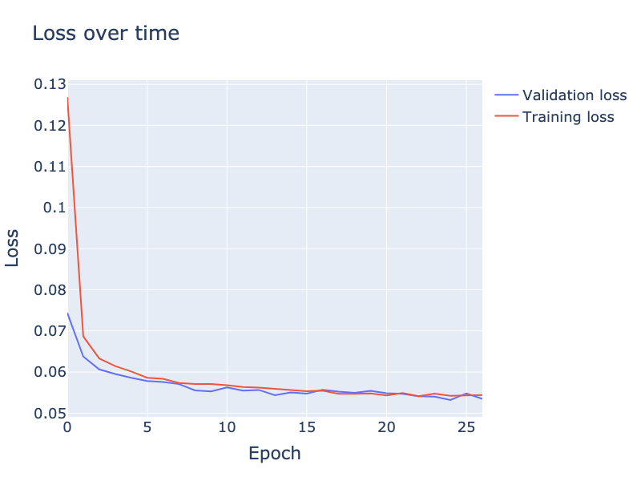

# Diffusion in PyTorch

Implementation of diffusion in pure PyTorch.


Adapted from: [https://github.com/davidADSP/Generative_Deep_Learning_2nd_Edition/blob/b91507a769bc40d87f1428f3eabba11dda6ea8c0/notebooks/08_diffusion/01_ddm/ddm.ipynb#L104](https://github.com/davidADSP/Generative_Deep_Learning_2nd_Edition/blob/b91507a769bc40d87f1428f3eabba11dda6ea8c0/notebooks/08_diffusion/01_ddm/ddm.ipynb#L104)

## Running

* Data - download from: [https://www.kaggle.com/datasets/nunenuh/pytorch-challange-flower-dataset](https://www.kaggle.com/datasets/nunenuh/pytorch-challange-flower-dataset). Let `/path/to/data` be the path to the folder that contains the `train` and `test` folders.

* Training:

    ```bash
    python main.py --conf conf.yml --command train --mnt-dir /path/to/data
    ```

* Generate samples:

    ```bash
    python main.py --conf conf.yml --command generate
    ```

* Plot loss:

    ```bash
    python main.py --conf conf.yml --command loss --show
    ```


